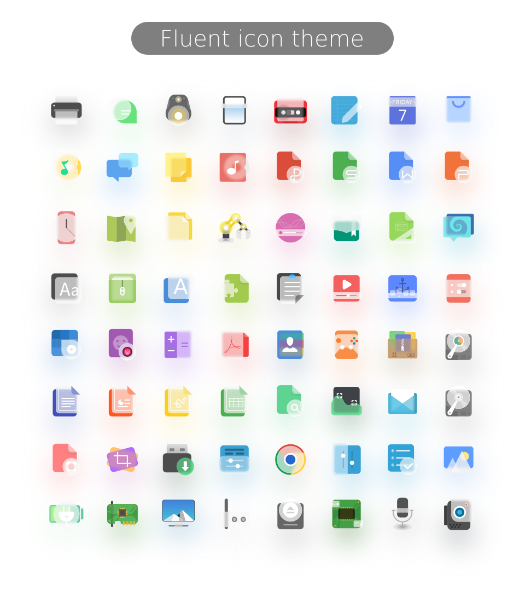

## Installation

Usage:  `./install.sh`  **[OPTIONS...]** **[COLOR VARIANTS...]**

|  OPTIONS:   |                                                                               |
|:------------|:------------------------------------------------------------------------------|
| -a, --all   | Install all color versions                                                    |
| -d, --dest  | Specify theme destination directory (**Default:** _$HOME/.local/share/icons_) |
| -n, --name  | Specify theme name (**Default:** _Fluent_)                                    |
| -r, --round | Install rounded version                                                       |
| -b, --black | Install black panel icon version                                              |
| -h, --help  | Show this help                                                                |

|  COLOR VARIANTS |                                       |
|:----------------|:--------------------------------------|
| standard        | Standard color folder version         |
| matrix          | Matrix color folder version           |
| ocean           | Ocean color folder version            |
| orange          | Orange color folder version           |
| rose            | Rose color folder version             |
| space           | Space color folder version            |
| sunrise         | Sunrise color folder version          |
| fire            | Fire color folder version             |

By default, only **the standard one** is selected.
